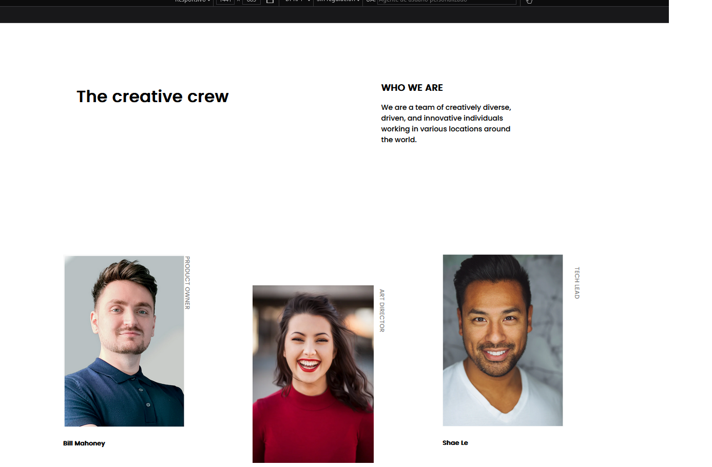
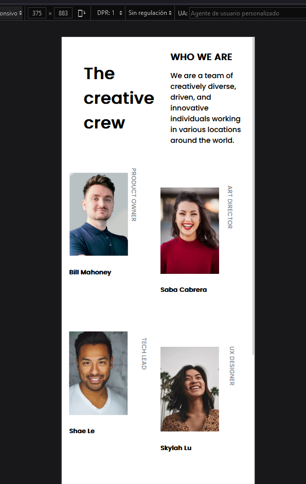

# Make It Real - NAME OF THE PROJECT

a reply was given on a responsive page

## Table of contents

- [Overview](#overview)
  - [The challenge](#the-challenge)
  - [Screenshot](#screenshot)
- [My process](#my-process)
  - [Built with](#built-with)
  - [What I learned](#what-i-learned)
  - [Continued development](#continued-development)
  - [Useful resources](#useful-resources)
- [Author](#author)
- [Acknowledgments](#acknowledgments)


## Overview

### The challenge

Users should be able to:

- Mobile 375
- Desktop 1440px

### Screenshot





## My process

### Built with

- HTML5
- CSS
- Flexbox
- Mobile-first workflow

### What I learned

Aprendi a verificar y manipular mi segunda columna y a rotar palabras


```css
.container > .image-wrapper:nth-child(3n + 2) {
    margin-top: 20%;
  }
.vertical-text {
  transform: translateY(-50%) rotate(90deg);}
```

### Continued development
En dividir algunos div y linealizar mi trabajo

### Useful resources

## Author

- Github - [@JohanEmersonPinares](https://github.com/JohanEmersonPinares)


## Acknowledgments
.Agradecer al internet que me brinda soluciones y ayuda
